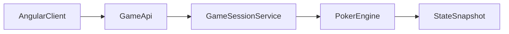

# Angular Bridge Plan (Post-Console Deploy)

This document defines the boundary refactor so Angular can drive the poker game without rewriting core rules.

## Current Coupling

- `TexasHoldemGame` directly renders console output and pauses for Enter
- `HumanPlayerController` directly reads from `Scanner`
- Turn loop and table refresh are tied to terminal timing

## Target Architecture

## Refactor Stages

### Stage 1: Extract Pure Engine State

Goal: keep poker logic independent from any terminal/web transport.

Actions:

1. Introduce `GameSnapshot` DTO:
   - phase, pot, board cards
   - per-player public info (chips, current bet, status)
   - action metadata (`toAct`, `toCall`, last actions)
2. Add `TexasHoldemGame#getSnapshot()` that returns current immutable snapshot.
3. Keep existing console rendering by mapping snapshot to `GameDisplay`.

### Stage 2: Replace Direct Console Input

Goal: remove scanner dependency from game flow.

Actions:

1. Introduce `ActionProvider` abstraction:
   - `PlayerAction requestAction(PlayerContext ctx)`
   - `int requestRaiseAmount(PlayerContext ctx)`
2. Have `HumanPlayerController` implement `ActionProvider` via console adapter (temporary).
3. Add a second adapter for API-driven actions.

### Stage 3: Sessionized Game Service

Goal: host multiple isolated matches for web users.

Actions:

1. Add `GameSessionService` to manage:
   - session create/start
   - per-session `TexasHoldemGame` instance
   - action submission and snapshot retrieval
2. Store sessions in-memory first (sandbox), then move to Redis or DB if needed.

### Stage 4: HTTP + WebSocket Transport

Goal: Angular UI can render and play in real time.

Suggested endpoints:

- `POST /api/sessions` create a game session
- `GET /api/sessions/{id}` fetch snapshot
- `POST /api/sessions/{id}/actions` submit action
- `WS /ws/sessions/{id}` stream snapshot updates

## Backward Compatibility

Keep `MainClass` console mode as a fallback:

- `MainClass` remains a valid local CLI entry point
- API mode can be introduced in a separate launcher class later

## Expected Outcome

After this bridge work:

- Angular UI can drive exactly the same game logic
- Console mode stays intact for testing/debugging
- Rule engine remains single-source (no duplicated poker logic)
